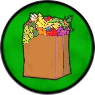

# Żetony

Poza kartami i planszetkami, gra potrzebuje jeszcze kilku rodzai żetonów. Można je pozyskać w różny sposób. Najprostsza wersja to wydruk grafik, przyklejenie
na bloku technicznym lub brystolu i wycięcie nożyczkami. Ot, takie papierowe znaczniki.

Można też znaleźć czyste kółka w wyprasce, przykładowo mepel.pl sprzedaje coś takiego:

* https://mepel.pl/czyste-kolko-zeton-15mm-w-wyprasce-70-sztuk

...i na nich ponaklejać wydruki, przyciąć nożyczkami i będzie wystarczająco dobrze.

Wersja droższa to zakupić czyste żetony plastikowe/drewniane i je obkleić wydrukowanymi ikonkami. Przykładowo, w mepel.pl można kupić drewniane znaczniki w
wybranym kolorze:

* https://mepel.pl/pl/searchquery/cylinder/1/phot/5?url=cylinder

Ja używam plastikowych żetonów [Fantasy Flight Supply](https://www.fantasyflightgames.com/en/products/fantasy-flight-supply/), których raczej już nie ma dostępnych:

Współczesnym odpowiednikiem mogłyby być [Dreamtrace Game Tokens](https://www.ghostgalaxy.com/pages/dreamtrace), ale nie wiem czy są dostępne w Polsce.

# Żetony pieniędzy

Ze wstępnych testów wynika, że do wygodnego grania wystarczy łącznie 127 "dolarów" w grze. Dla przykładu rozkład:
* 3 żetony 20 dolarowe
* 8 żetonów 5 dolarowych
* 27 żetonów 1 dolarowych
Jest dobrym kompromisem pomiędzy ilością żetonów a ich przydatnością.

Możecie dowolny inny rozkład sobie przygotować/wydrukować. Może macie zastępcze pieniądze z innej gry. Albo kupić
[gotowy zestaw](https://mepel.pl/micro-moonshine-drewniane-banknoty). Albo użyć zupełnie innych nominałów - tak długo
jak wam to działa to używajcie tego co macie.

Ja użyłem do żetonów 1-dolarowych grafik z [zetony.xcf](../src/zetony.xcf) (mogę je wyeksportować do .png jeśli dacie znać, że potrzebujecie),
nadrukowanych na [żółte plastikowe żetony 14 x 4mm](https://www.fantasyflightgames.com/en/products/fantasy-flight-supply/products/gold-gaming-tokens/).

Do 5-dolarowych żetonów takiej grafiki: [banknoty-piecodolarowe.png](../src/banknoty-pieciodolarowe.png) - nadrukowane na brystol,
posklejane kilkukrotne w grubsze warstwy i przyciete nozyczkami.

Do 20-dolarowych żetonów użyłem "sztabek złota" z brystolu, ale nie mam już do nich źródeł - zgubiły się w odmętach czasu. Myślę, że dowolny
inny żeton zastępczy też będzie ok.

# Żetony jedzenia

Gra może wymagać 12 żetonów jedzenia. Mogą być dowolnego kształtu i koloru, ja użyłem grafiki

nadrukowanej z obu stron na [zielone plastikowe żetony 14 x 4mm](https://www.fantasyflightgames.com/en/products/fantasy-flight-supply/products/green-gaming-tokens/)

# Żetony trwałości/nauki

todo

# Żetony głodu

# Żeton pierwszego gracza

# Żetony domków

# Żetony pionków
